# PCBuilderShop

## 👥 Miembros del Equipo
| Nombre y Apellidos | Correo URJC | Usuario GitHub |
|:--- |:--- |:--- |
| David Díaz Gómez-Escalonilla | d.diaz.2021@alumnos.urjc.es | daviddge |
| Jonay Sebastián Oortiz Armas| js.ortiz.2023@alumnos.urjc.es | kuuharuh |
| Ramiro Daniel Flores Aquino | rd.flores.2025@alumnos.urjc.es | danilo-uni |
| Joel Domené Álvaro | j.domene.2022@alumnos.urjc.es |  joel-domene |

---

## 🎭 **Preparación: Definición del Proyecto**

### **Descripción del Tema**
Aplicación web dedicada exclusivamente a la venta de componentes de PC, orientada al sector de la informática y el hardware. La plataforma ofrece un catálogo especializado (CPU, GPU, RAM, placas base, SSDs y otros componentes) pensado para usuarios que desean montar, actualizar o personalizar su propio ordenador. Se busca aportar al usuario un entorno centrado únicamente en componentes, facilitando la comparación, selección y compra de piezas compatibles.

### **Entidades**

1. **Usuario**
2. **Producto**
3. **Pedido**
4. **Reseña**

**Relaciones entre entidades:**
- Usuario - Pedido: Cada usuario registrado puede generar uno o varios pedidos (1:N).
- Pedido - Producto: Un pedido está compuesto por distintos productos, y un mismo producto puede aparecer en varios pedidos (N:M).
- Usuario - Reseña : Un usuario puede escribir multiples reseñas sobre productos adquiridos (1:N).
- Producto - Reseña: Un producto puede tener distintas reseñas publicadas por los usuarios (1:N).

### **Permisos de los Usuarios**

**Usuario Anónimo**: 
  - Permisos: Explorar catálogo, buscar productos, registrarse/iniciar sesion.
  - No es dueño de ninguna entidad.

**Usuario Registrado**: 
  - Permisos: Gestionar su perfil, escribir reseñas y gestionar pedido.
  - Es dueño de sus propios pedidos, de su usuario y sus reseñas.

**Administrador**: 
  - Permisos: Gestión completa de productos (CRUD), visualizar estadísticas, administrar reseñas, gestionar promociones, supervisar usuarios y pedidos.
  - Tiene acceso y control sobre todas las entidades del sistema (Pedidos, Usuarios, Productos y Reseñas).

### **Imágenes**

- Usuario - Se podrá subir una imagen de perfil.
- Producto - Dispondrá de una galería de imágenes para mostrar distintos ángulos o detalles.
- Reseña - Permite añadir imagenes opcionales subidas por el usuario.

### **Gráficos**

- Evolución de ventas mensuales - Gráfico de barras
- Ranking de productos más vendidos - Gráfico circular
- Crecimiento de usuarios registrados - Gráfico de líneas
- Distribución de pedidos por categoría - Gráfico de barras horizontales
- Valoración media de los productos - Sistemas de estrellas o barras

### **Tecnología Complementaria**

- Envío automático correos electrónicos mediante JavaMailSender.
- Generación de facturas en formato PDF usando iText o similar.

### **Algoritmo o Consulta Avanzada**

- **Algoritmo/Consulta**: Sistema de recomendaciones de distintos productos basado en el historial de compras del usuario.
- **Descripción**: Se analizarán los productos adquiridos anteriormente con el objetivo de sugerir otros productos similares o complementarios a través de técnicas de filtrado colaborativo.
- **Alternativa**: Consulta avanzada que agrupe ventas por categoría, mes y región, identificando patrones o tendencias.

---

## 🛠 **Práctica 1: Maquetación de páginas web con HTML y CSS**

### **Diagrama de Navegación**
Diagrama que muestra cómo se navega entre las diferentes páginas de la aplicación:

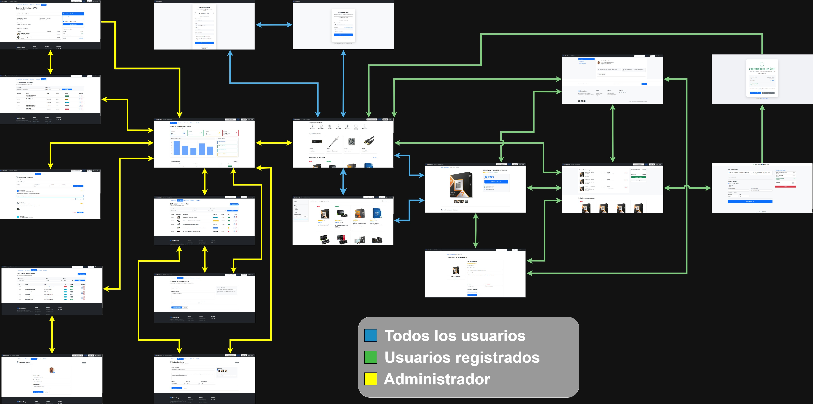


Todos los usuarios parte desde la página principal, y hay acceso sin restricciones a las páginas de busqueda, página del producto y las pantallas de inicio de sesión y registro. Sin embargo, las páginas correspondientes al perfil, el carrito de compra, proceso de pago y crear reseñas requieren que el usuario haya iniciado su sesión. El administrador tiene acceso a todas las pantallas anteriores, además del admin-dashboard, que es el panel de control del admin donde puede administrar cada entidad de la página.

### **Capturas de Pantalla y Descripción de Páginas**

#### **1. Página Principal / Home**

Esta es la pagina principal de la pagina en la que tenemos una serie de productos recomendados, además de distintas novedades en hardware. En el header se incluye la barra de navegación, el acceso a la cesta para usuarios registrados, y boton dropdown que permite acceder al perfil o cerrar sesión. En el caso de no estar logueado, se muestra un botón "Entrar" para iniciar sesión o registrarse.
-  La pagina de incio tambien te muestra las categorias de hardware disponibles, las cuales también se pueden visualizar desde el menu desplegable del header dandole a "categorias"
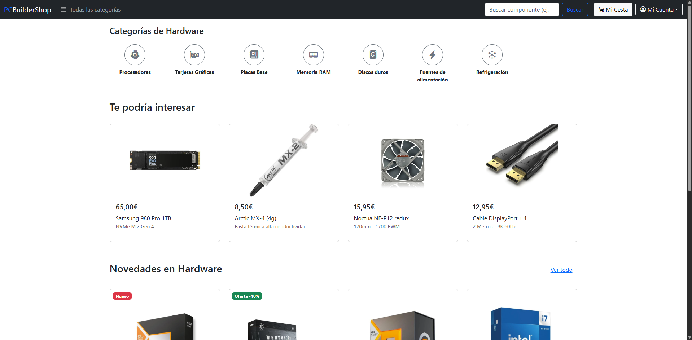

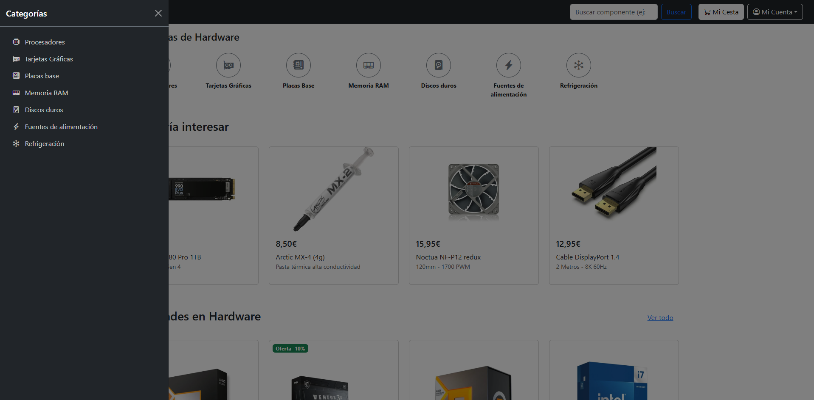

#### **RESTO DE PÁGINAS**

#### **TODOS LOS USUARIOS**

#### **2. Pagina de busqueda:**
Muestra una lista de  productos en una cuadrícula con sus datos principales. También tiene implementada una barra lateral con filtros por marca y rango de precio, además de un selector para ordenar los resultados según lo que busque el usuario.

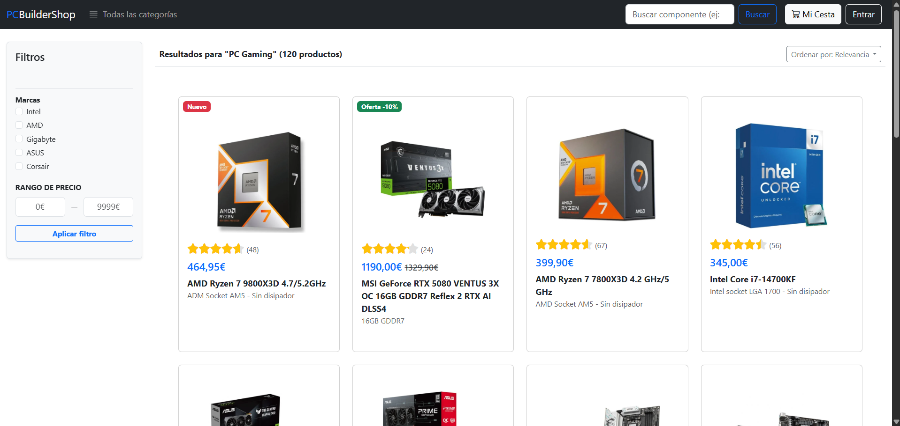

#### **3. Pagina de Producto:**
Maquetación detallada del componente con un carrusel de imágenes y la zona de compra. Contiene una tabla para las especificaciones técnicas y una sección de reseñas donde los usuarios pueden ver las valoraciones y opiniones de otros compradores.


#### **4. Pagina de Login:**
En esta pantalla nos muestra como una persona que ya tiene cuenta de la pagina puede inciar sesion añadiendo su correo y contraseña o tambien te da la opcion de iniciar sesion con tu cuenta de google.


#### **5. Pagina de Registro:**
Esta pantalla es para que las personas que no tienen cuenta creada, la puedan tener añadiendo sus datos como correo, nombre, contraseña(repetir contraseña) y aceptar por obligacion las politicas de privacidad. Aqui tambien te da la opcion como el login en la que puedes resgistrarte con google.

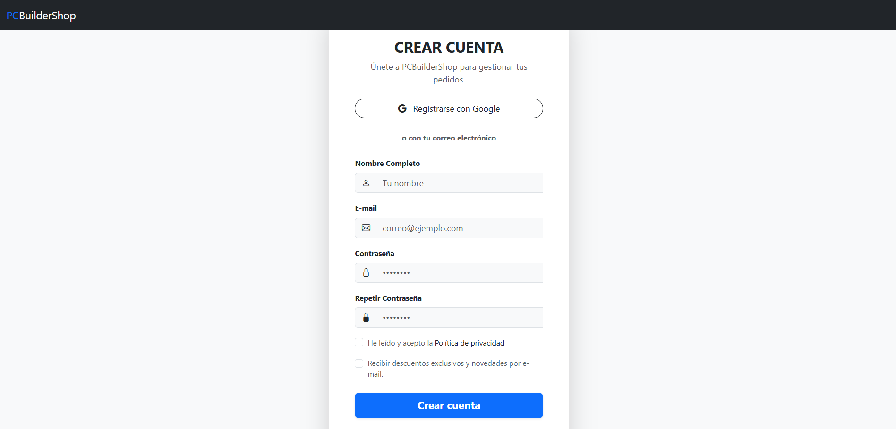

#### **USUARIOS REGISTRADOS**

#### **6. Pagina de Perfil:**

En esta pantalla 
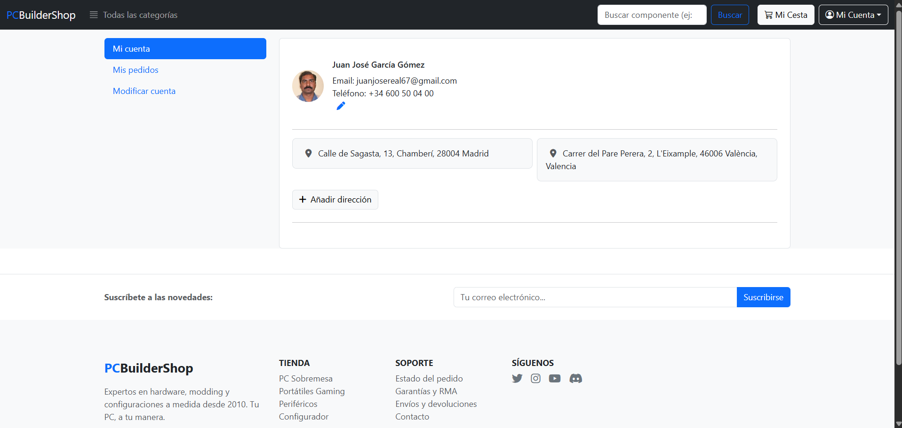

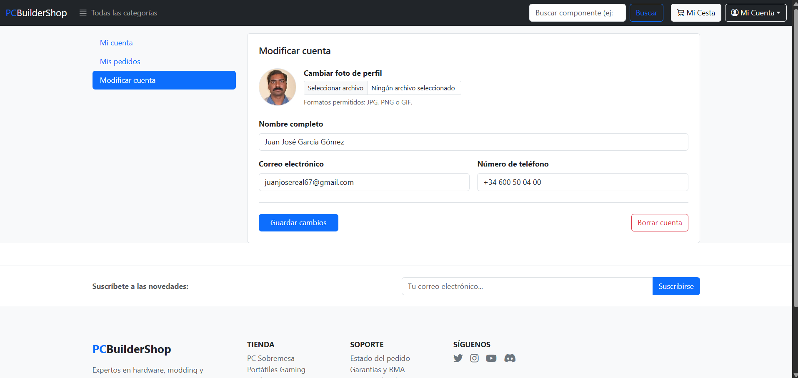

#### **7. Pagina de Carrito:**


#### **8. Pagina de Pago:**
En esta pantalla podemos ver como hemos implentado la forma de pago en lo que podemos seleccionar(solo una) y añadir la direccion del envio , tambien nos permite el tipo de pago (Tarjeta o PayPal) y el relleno de los datos de la tajeta. Y para hacer un seguimiento de la compra ,en el lado derecho de la pantalla se ve el resumen de la compra con el precio total y listo el boton para comprar y para salir si se arrepiente.


En esta pantalla basicamente nos muestra el resultado de la compra al saber que el pago a sido recibido correctamente y además nos sale la opcion de descargar el pdf para ver la factura de la compra, al lado suyo tambien con el boton de volver a la tienda para seguir comprando o viendo mas componentes.
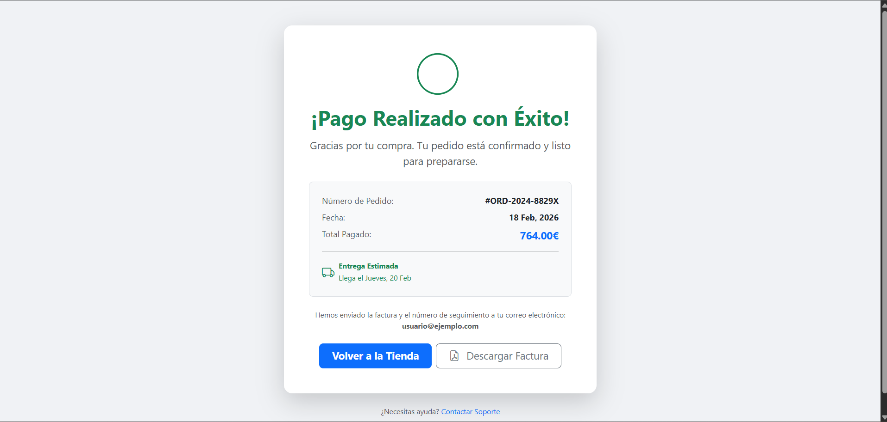

#### **9. Pagina de Crear Review:**
Formulario para que los usuarios valoren los productos comprados. Incluye un sistema de puntuación por estrellas, campos de texto para el título y el comentario, y secciones específicas para listar pros y contras, además de permitir la subida de imágenes reales del componente.
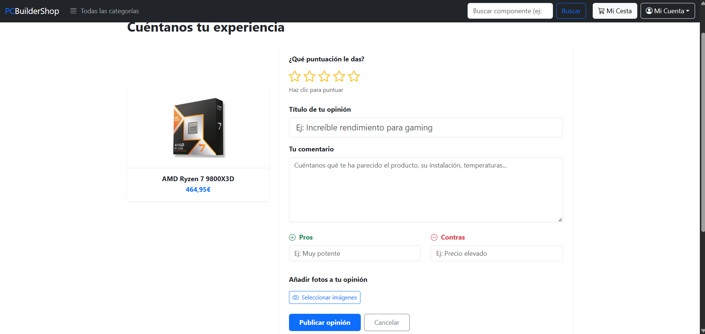

#### **ADMINISTRADOR**

#### **10. Pagina de Admin-Dashboard:**


#### **11. Pagina de Lista Producto:**

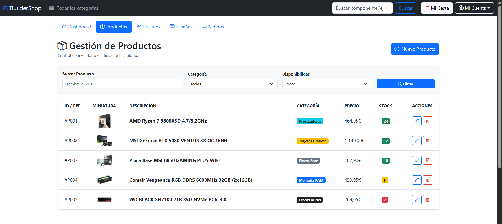

#### **12. Pagina de Crear Producto:**

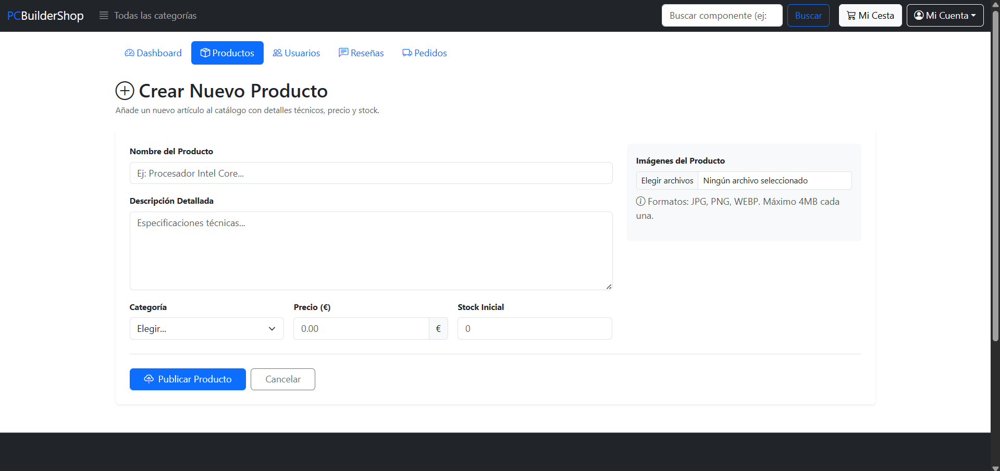

#### **13. Pagina de Editar Producto:**


#### **14. Pagina de Lista Usuarios:**


#### **15. Pagina de Editar Usuarios:**

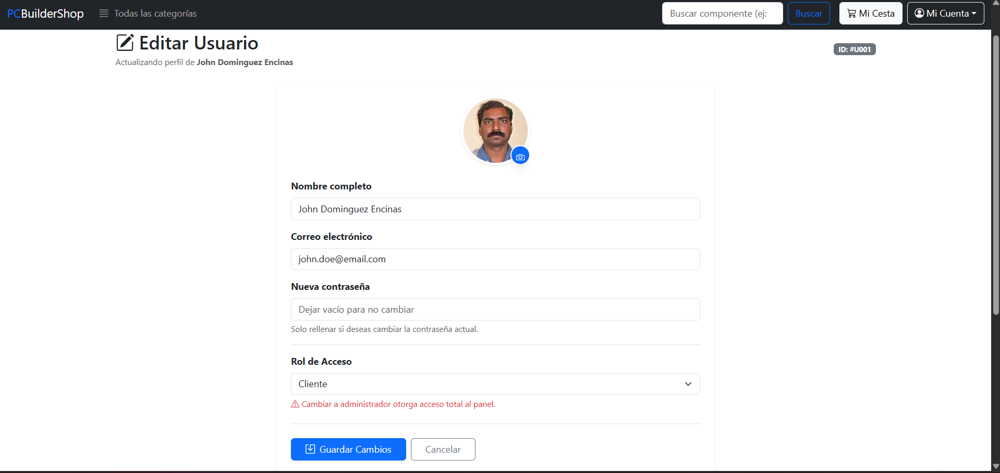

#### **16. Pagina de Lista Reseñas:**


#### **17. Pagina de Lista Pedidos:**
Incluye una barra de navegación superior para conmutar entre métricas y gestión de inventario, además de filtros por estado y un buscador de clientes.
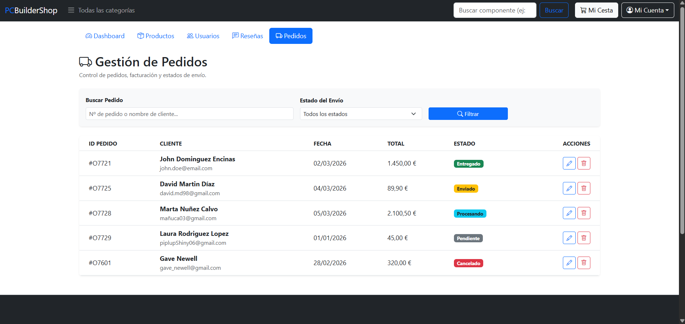

#### **18. Pagina de Modificar Pedidos:**
Permite actualizar el estado del envío entre Pendiente, Procesando, Enviado, Entregado, y Cancelado. Notifica al cliente automáticamente por correo si asi se indica y muestra tanto el desglose de productos como el resumen económico con impuestos incluidos
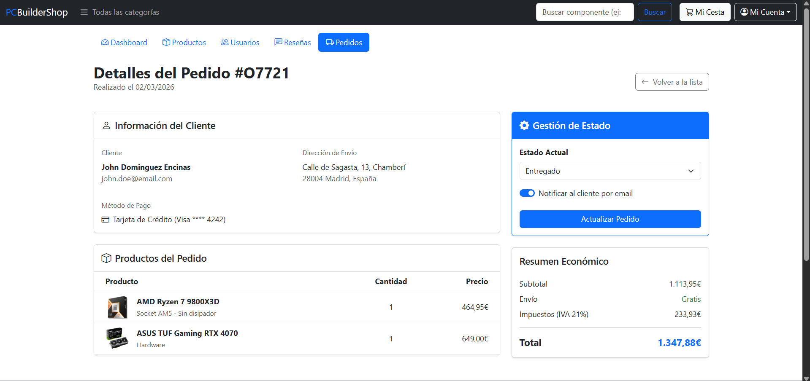


### **Participación de Miembros en la Práctica 1**

#### **Alumno 1 - Ramiro Daniel Flores Aquino**

Mi participación fue el encargado de la implementacion y edición de las paginas del menú principal(index.html), implementé las paginas de login(login.html) y registro(user_registration.html) y también las paginas de pago(payment.html) y la pantalla de pago correcto(payment_correct.html).

| Nº    | Commits      | Files      |
|:------------: |:------------:| :------------:|
|1| [Descripción commit 1](URL_commit_1)  | [Archivo1](URL_archivo_1)   |
|2| [Descripción commit 2](URL_commit_2)  | [Archivo2](URL_archivo_2)   |
|3| [Descripción commit 3](URL_commit_3)  | [Archivo3](URL_archivo_3)   |
|4| [Descripción commit 4](URL_commit_4)  | [Archivo4](URL_archivo_4)   |
|5| [Descripción commit 5](URL_commit_5)  | [Archivo5](URL_archivo_5)   |

---

#### **Alumno 2 - David Díaz Gómez-Escalonilla**

[Descripción de las tareas y responsabilidades principales del alumno en el proyecto]
Principal responsable de las páginas de search-result, item-detail, create-review, user-list, user-edit, order-list, order-edit y los headers. También he ayudado con la estructura del index.html para que fuera similar a la de search-result.
Creación y diseño del diagrama de navegación de README, junto con la inserción de las imagenes el resto de páginas junto con su descripción..

| Nº    | Commits      | Files      |
|:------------: |:------------:| :------------:|
|1| [search-result html implementation](https://github.com/CodeURJC-SSDD-2025-26/practica-ssdd-2025-26-grupo-4/commit/492fb1a6cb0778e6813eb550ac9eca71604968f7)  | [Archivo1](URL_archivo_1)   |

|2| [Descripción commit 2](URL_commit_2)  | [Archivo2](URL_archivo_2)   |
|3| [Descripción commit 3](URL_commit_3)  | [Archivo3](URL_archivo_3)   |
|4| [Descripción commit 4](URL_commit_4)  | [Archivo4](URL_archivo_4)   |
|5| [Descripción commit 5](URL_commit_5)  | [Archivo5](URL_archivo_5)   |

---

#### **Alumno 3 - Jonay Sebastián Oortiz Armas**

[Descripción de las tareas y responsabilidades principales del alumno en el proyecto]

| Nº    | Commits      | Files      |
|:------------: |:------------:| :------------:|
|1| [Descripción commit 1](URL_commit_1)  | [Archivo1](URL_archivo_1)   |
|2| [Descripción commit 2](URL_commit_2)  | [Archivo2](URL_archivo_2)   |
|3| [Descripción commit 3](URL_commit_3)  | [Archivo3](URL_archivo_3)   |
|4| [Descripción commit 4](URL_commit_4)  | [Archivo4](URL_archivo_4)   |
|5| [Descripción commit 5](URL_commit_5)  | [Archivo5](URL_archivo_5)   |

---

#### **Alumno 4 - Joel Domené Álvaro**

[Descripción de las tareas y responsabilidades principales del alumno en el proyecto]

| Nº    | Commits      | Files      |
|:------------: |:------------:| :------------:|
|1| [Descripción commit 1](URL_commit_1)  | [Archivo1](URL_archivo_1)   |
|2| [Descripción commit 2](URL_commit_2)  | [Archivo2](URL_archivo_2)   |
|3| [Descripción commit 3](URL_commit_3)  | [Archivo3](URL_archivo_3)   |
|4| [Descripción commit 4](URL_commit_4)  | [Archivo4](URL_archivo_4)   |
|5| [Descripción commit 5](URL_commit_5)  | [Archivo5](URL_archivo_5)   |

---

## 🛠 **Práctica 2: Web con HTML generado en servidor**

### **Navegación y Capturas de Pantalla**

#### **Diagrama de Navegación**

Solo si ha cambiado.

#### **Capturas de Pantalla Actualizadas**

Solo si han cambiado.

### **Instrucciones de Ejecución**

#### **Requisitos Previos**
- **Java**: versión 21 o superior
- **Maven**: versión 3.8 o superior
- **MySQL**: versión 8.0 o superior
- **Git**: para clonar el repositorio

#### **Pasos para ejecutar la aplicación**

1. **Clonar el repositorio**
   ```bash
   git clone https://github.com/[usuario]/[nombre-repositorio].git
   cd [nombre-repositorio]
   ```

2. **AQUÍ INDICAR LO SIGUIENTES PASOS**

#### **Credenciales de prueba**
- **Usuario Admin**: usuario: `admin`, contraseña: `admin`
- **Usuario Registrado**: usuario: `user`, contraseña: `user`

### **Diagrama de Entidades de Base de Datos**

Diagrama mostrando las entidades, sus campos y relaciones:


> [Descripción opcional: Ej: "El diagrama muestra las 4 entidades principales: Usuario, Producto, Pedido y Categoría, con sus respectivos atributos y relaciones 1:N y N:M."]

### **Diagrama de Clases y Templates**

Diagrama de clases de la aplicación con diferenciación por colores o secciones:


> [Descripción opcional del diagrama y relaciones principales]

### **Participación de Miembros en la Práctica 2**

#### **Alumno 1 - [Nombre Completo]**

[Descripción de las tareas y responsabilidades principales del alumno en el proyecto]

| Nº    | Commits      | Files      |
|:------------: |:------------:| :------------:|
|1| [Descripción commit 1](URL_commit_1)  | [Archivo1](URL_archivo_1)   |
|2| [Descripción commit 2](URL_commit_2)  | [Archivo2](URL_archivo_2)   |
|3| [Descripción commit 3](URL_commit_3)  | [Archivo3](URL_archivo_3)   |
|4| [Descripción commit 4](URL_commit_4)  | [Archivo4](URL_archivo_4)   |
|5| [Descripción commit 5](URL_commit_5)  | [Archivo5](URL_archivo_5)   |

---

#### **Alumno 2 - [Nombre Completo]**

[Descripción de las tareas y responsabilidades principales del alumno en el proyecto]

| Nº    | Commits      | Files      |
|:------------: |:------------:| :------------:|
|1| [Descripción commit 1](URL_commit_1)  | [Archivo1](URL_archivo_1)   |
|2| [Descripción commit 2](URL_commit_2)  | [Archivo2](URL_archivo_2)   |
|3| [Descripción commit 3](URL_commit_3)  | [Archivo3](URL_archivo_3)   |
|4| [Descripción commit 4](URL_commit_4)  | [Archivo4](URL_archivo_4)   |
|5| [Descripción commit 5](URL_commit_5)  | [Archivo5](URL_archivo_5)   |

---

#### **Alumno 3 - [Nombre Completo]**

[Descripción de las tareas y responsabilidades principales del alumno en el proyecto]

| Nº    | Commits      | Files      |
|:------------: |:------------:| :------------:|
|1| [Descripción commit 1](URL_commit_1)  | [Archivo1](URL_archivo_1)   |
|2| [Descripción commit 2](URL_commit_2)  | [Archivo2](URL_archivo_2)   |
|3| [Descripción commit 3](URL_commit_3)  | [Archivo3](URL_archivo_3)   |
|4| [Descripción commit 4](URL_commit_4)  | [Archivo4](URL_archivo_4)   |
|5| [Descripción commit 5](URL_commit_5)  | [Archivo5](URL_archivo_5)   |

---

#### **Alumno 4 - [Nombre Completo]**

[Descripción de las tareas y responsabilidades principales del alumno en el proyecto]

| Nº    | Commits      | Files      |
|:------------: |:------------:| :------------:|
|1| [Descripción commit 1](URL_commit_1)  | [Archivo1](URL_archivo_1)   |
|2| [Descripción commit 2](URL_commit_2)  | [Archivo2](URL_archivo_2)   |
|3| [Descripción commit 3](URL_commit_3)  | [Archivo3](URL_archivo_3)   |
|4| [Descripción commit 4](URL_commit_4)  | [Archivo4](URL_archivo_4)   |
|5| [Descripción commit 5](URL_commit_5)  | [Archivo5](URL_archivo_5)   |

---

## 🛠 **Práctica 3: API REST, docker y despliegue**

### **Documentación de la API REST**

#### **Especificación OpenAPI**
📄 **[Especificación OpenAPI (YAML)](/api-docs/api-docs.yaml)**

#### **Documentación HTML**
📖 **[Documentación API REST (HTML)](https://raw.githack.com/[usuario]/[repositorio]/main/api-docs/api-docs.html)**

> La documentación de la API REST se encuentra en la carpeta `/api-docs` del repositorio. Se ha generado automáticamente con SpringDoc a partir de las anotaciones en el código Java.

### **Diagrama de Clases y Templates Actualizado**

Diagrama actualizado incluyendo los @RestController y su relación con los @Service compartidos:


### **Instrucciones de Ejecución con Docker**

#### **Requisitos previos:**
- Docker instalado (versión 20.10 o superior)
- Docker Compose instalado (versión 2.0 o superior)

#### **Pasos para ejecutar con docker-compose:**

1. **Clonar el repositorio** (si no lo has hecho ya):
   ```bash
   git clone https://github.com/[usuario]/[repositorio].git
   cd [repositorio]
   ```

2. **AQUÍ LOS SIGUIENTES PASOS**:

### **Construcción de la Imagen Docker**

#### **Requisitos:**
- Docker instalado en el sistema

#### **Pasos para construir y publicar la imagen:**

1. **Navegar al directorio de Docker**:
   ```bash
   cd docker
   ```

2. **AQUÍ LOS SIGUIENTES PASOS**

### **Despliegue en Máquina Virtual**

#### **Requisitos:**
- Acceso a la máquina virtual (SSH)
- Clave privada para autenticación
- Conexión a la red correspondiente o VPN configurada

#### **Pasos para desplegar:**

1. **Conectar a la máquina virtual**:
   ```bash
   ssh -i [ruta/a/clave.key] [usuario]@[IP-o-dominio-VM]
   ```
   
   Ejemplo:
   ```bash
   ssh -i ssh-keys/app.key vmuser@10.100.139.XXX
   ```

2. **AQUÍ LOS SIGUIENTES PASOS**:

### **URL de la Aplicación Desplegada**

🌐 **URL de acceso**: `https://[nombre-app].etsii.urjc.es:8443`

#### **Credenciales de Usuarios de Ejemplo**

| Rol | Usuario | Contraseña |
|:---|:---|:---|
| Administrador | admin | admin123 |
| Usuario Registrado | user1 | user123 |
| Usuario Registrado | user2 | user123 |

### **OTRA DOCUMENTACIÓN ADICIONAL REQUERIDA EN LA PRÁCTICA**

### **Participación de Miembros en la Práctica 3**

#### **Alumno 1 - [Nombre Completo]**

[Descripción de las tareas y responsabilidades principales del alumno en el proyecto]

| Nº    | Commits      | Files      |
|:------------: |:------------:| :------------:|
|1| [Descripción commit 1](URL_commit_1)  | [Archivo1](URL_archivo_1)   |
|2| [Descripción commit 2](URL_commit_2)  | [Archivo2](URL_archivo_2)   |
|3| [Descripción commit 3](URL_commit_3)  | [Archivo3](URL_archivo_3)   |
|4| [Descripción commit 4](URL_commit_4)  | [Archivo4](URL_archivo_4)   |
|5| [Descripción commit 5](URL_commit_5)  | [Archivo5](URL_archivo_5)   |

---

#### **Alumno 2 - [Nombre Completo]**

[Descripción de las tareas y responsabilidades principales del alumno en el proyecto]

| Nº    | Commits      | Files      |
|:------------: |:------------:| :------------:|
|1| [Descripción commit 1](URL_commit_1)  | [Archivo1](URL_archivo_1)   |
|2| [Descripción commit 2](URL_commit_2)  | [Archivo2](URL_archivo_2)   |
|3| [Descripción commit 3](URL_commit_3)  | [Archivo3](URL_archivo_3)   |
|4| [Descripción commit 4](URL_commit_4)  | [Archivo4](URL_archivo_4)   |
|5| [Descripción commit 5](URL_commit_5)  | [Archivo5](URL_archivo_5)   |

---

#### **Alumno 3 - [Nombre Completo]**

[Descripción de las tareas y responsabilidades principales del alumno en el proyecto]

| Nº    | Commits      | Files      |
|:------------: |:------------:| :------------:|
|1| [Descripción commit 1](URL_commit_1)  | [Archivo1](URL_archivo_1)   |
|2| [Descripción commit 2](URL_commit_2)  | [Archivo2](URL_archivo_2)   |
|3| [Descripción commit 3](URL_commit_3)  | [Archivo3](URL_archivo_3)   |
|4| [Descripción commit 4](URL_commit_4)  | [Archivo4](URL_archivo_4)   |
|5| [Descripción commit 5](URL_commit_5)  | [Archivo5](URL_archivo_5)   |

---

#### **Alumno 4 - [Nombre Completo]**

[Descripción de las tareas y responsabilidades principales del alumno en el proyecto]

| Nº    | Commits      | Files      |
|:------------: |:------------:| :------------:|
|1| [Descripción commit 1](URL_commit_1)  | [Archivo1](URL_archivo_1)   |
|2| [Descripción commit 2](URL_commit_2)  | [Archivo2](URL_archivo_2)   |
|3| [Descripción commit 3](URL_commit_3)  | [Archivo3](URL_archivo_3)   |
|4| [Descripción commit 4](URL_commit_4)  | [Archivo4](URL_archivo_4)   |
|5| [Descripción commit 5](URL_commit_5)  | [Archivo5](URL_archivo_5)   |

---
